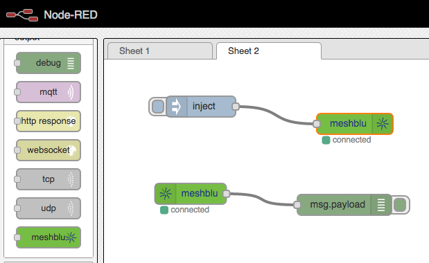

node-red-contrib-meshblu
========================

A set of input and output nodes for connecting node-red to [meshblu](http://meshblu.octoblu.com) (formerly skynet.im)

## Install via NPM

From inside your node-red directory:
```
npm node-red-contrib-meshblu
```

## Usage

You can connect to any meshblu server, and use that for subscribing to messages and sending output.

## Screenshot


